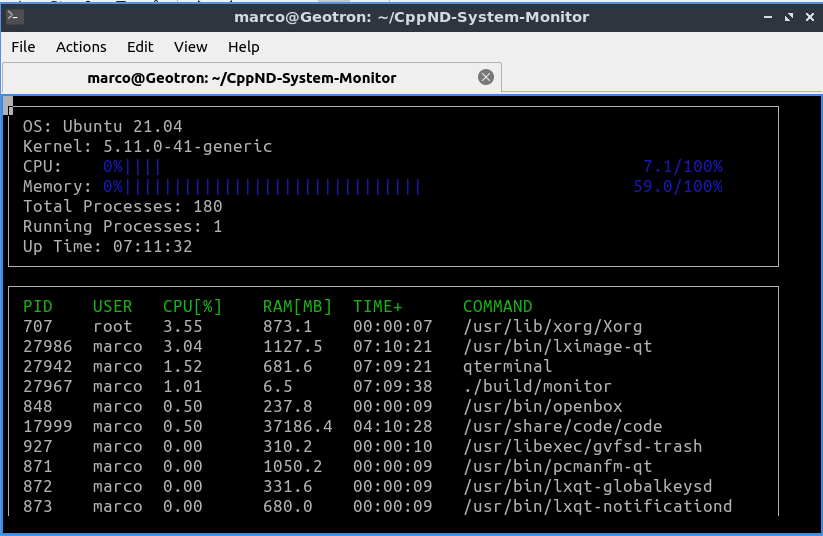
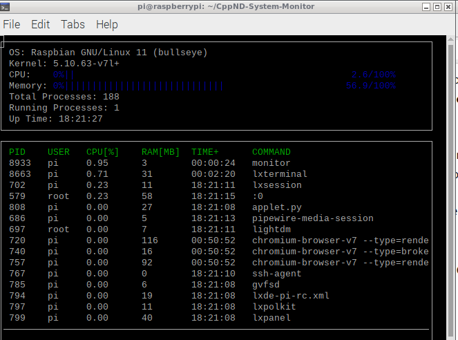

# CppND-System-Monitor

Fork and custom solution for System Monitor Project in the Object Oriented Programming Course of the [Udacity C++ Nanodegree Program](https://www.udacity.com/course/c-plus-plus-nanodegree--nd213). 



## Cloning

When cloning this project, be sure to use the `--recurse-submodules` flag. Using HTTPS:
```
git clone https://github.com/Frechete/CppND-System-Monitor.git --recurse-submodules
```
or with SSH:
```
git clone git@github.com:Frechete/CppND-System-Monitor.git --recurse-submodules
```

If you already cloned the project and forgot `--recurse-submodules`, you can combine the `git submodule init` and `git submodule update` steps by running `git submodule update --init`. To also initialize, fetch and checkout any nested submodules, you can use `git submodule update --init --recursive`.

## ncurses
[ncurses](https://www.gnu.org/software/ncurses/) is a library that facilitates text-based graphical output in the terminal. This project relies on ncurses for display output.
Install ncurses within your own Linux environment: `sudo apt install libncurses5-dev libncursesw5-dev`

## Make
This project uses [Make](https://www.gnu.org/software/make/). The Makefile has four targets:
* `build` compiles the source code and generates an executable
* `format` applies [ClangFormat](https://clang.llvm.org/docs/ClangFormat.html) to style the source code
* `debug` compiles the source code and generates an executable, including debugging symbols
* `clean` deletes the `build/` directory, including all of the build artifacts

## Instructions

1. Clone the project repository: `git clone https://github.com/Frechete/CppND-System-Monitor.git --recurse-submodules`

2. Build the project: `make build`

3. Run the resulting executable: `./build/monitor`

